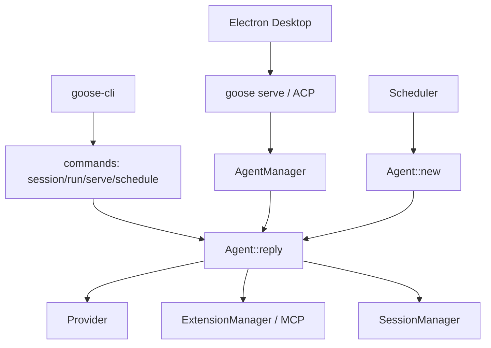

# Goose 아키텍처 지도

## 범위와 주의

이 문서는 `aaif-goose/goose` 기준 커밋 `6ccabb0f6ca26a564f7097a5a2676b12e5427755`의 현재 구현을 설명한다. 공식 문서나 discussion이 현재 `main` 코드와 다를 때는 코드가 우선 근거다.

## 패키지 구조

Goose는 Rust workspace와 Electron Desktop UI로 구성된다.

| 영역 | 주요 경로 | 역할 |
|------|-----------|------|
| Core | `crates/goose/` | Agent, session, extension, scheduler, recipe, permission, context 관리 |
| CLI | `crates/goose-cli/` | `session`, `run`, `serve`, `schedule`, `recipe`, `mcp`, `acp`, `tui` 명령 진입점 |
| Providers | `crates/goose-provider-types/`, `crates/goose-providers/` | provider trait, message/tool/usage 타입, Anthropic/OpenAI/Gemini 등 구현 |
| MCP | `crates/goose-mcp/` | MCP server/extension 관련 코드 |
| SDK | `crates/goose-sdk/`, `crates/goose-sdk-types/` | 외부 embedding/API 타입 |
| Desktop | `ui/desktop/` | Electron/React UI, `goose serve` 백엔드와 연결 |

## 진입점

CLI는 `crates/goose-cli/src/main.rs`에서 시작해 CLI parser가 명령별 실행 경로를 고른다. Desktop은 `ui/desktop/src/main.ts`에서 별도 프로세스로 `goose serve` ACP 백엔드를 띄우고 WebSocket/secret을 UI에 연결한다.

실제 에이전트 실행은 대부분 `crates/goose/src/agents/agent.rs`의 `Agent::reply`로 수렴한다. 다만 scheduler는 현행 코드에서 `AgentManager`를 통하지 않고 `Agent::new()`를 직접 사용하므로, "모든 실행 경로가 하나로 통합됐다"는 표현은 현재 구현 사실이 아니다.

## 핵심 컴포넌트

- `Agent`: provider 호출, tool request 분류, tool 실행, permission, retry, compaction, hook 처리를 조정한다.
- `SessionManager`: SQLite 기반 session/message/usage 저장소다. provider/model, recipe, schedule, parent session metadata를 함께 보관한다.
- `ExtensionManager`: MCP/stdio/http/builtin/platform extension을 로드하고 tool dispatch를 수행한다.
- `Provider`: `stream`, `complete`, model info, context limit, permission routing을 추상화한다.
- `Recipe`: prompt/instructions/extensions/settings/response/sub_recipes/retry를 묶은 재사용 실행 단위다.
- `Scheduler`: cron 기반 recipe 실행을 관리한다.
- `AgentManager`: serve/interactive 계열에서 session별 Agent lifecycle, LRU, cancellation을 관리한다.

## 현재 프로젝트 관점의 의미

현재 `cursor-agent`는 Leantime `CursorBridge`가 이벤트를 오케스트레이션하고 `agent-runner`가 Cursor SDK local session을 실행한다. Goose는 오케스트레이션·세션·provider·tool·recipe를 한 프로세스 안에 더 많이 끌어안는다. 따라서 직접 교체보다 세션 상태, tool 정책, subagent 격리, compaction 같은 내부 패턴을 선별 검토하는 것이 우선이다.
