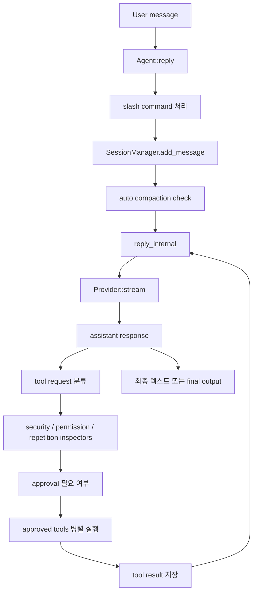

# Agent Loop

## 현재 구현

Goose의 핵심 루프는 `crates/goose/src/agents/agent.rs`의 `Agent::reply`와 `reply_internal`이다. 2026년 discussion #9944는 루프를 재진입 가능한 operation state machine으로 풀자는 제안이지만, 기준 커밋의 현재 구현은 하나의 큰 async stream 루프에 가깝다.

## 실행 흐름

`reply`는 사용자 메시지를 세션에 저장하고 slash command를 처리한다. 이어 context 사용량이 `GOOSE_AUTO_COMPACT_THRESHOLD`를 넘으면 compaction을 수행한 뒤 `reply_internal`로 들어간다.

`reply_internal`은 provider streaming 결과를 읽으면서 usage, assistant message, thinking, tool request를 이벤트로 내보낸다. tool request가 있으면 frontend tool과 backend tool을 나누고, backend tool은 inspector와 permission 결과에 따라 실행·거부·사용자 승인 대기로 분기한다.

## 자율성 제어

| 제어 | 현재 동작 |
|------|-----------|
| `max_turns` | session/recipe 설정 또는 `GOOSE_MAX_TURNS`; 초과 시 사용자에게 계속할지 묻는 메시지 |
| 빈 응답 | 모델 빈 응답을 제한 횟수까지 재시도 |
| stop hook | 종료 전 hook이 거부하면 컨텍스트 메시지를 넣고 재시도; 연속 거부 상한 있음 |
| context 초과 | compaction 1회 후 재시도; 재실패 시 종료 |
| recipe retry | success check 실패 시 history를 초기 상태로 되돌리고 재시도 |
| cancellation | cancellation token으로 루프와 tool 실행 중단 |

## Tool 실행

승인된 tool call은 futures stream으로 합쳐 병렬 실행된다. tool 실행 중 MCP notification과 action-required event가 발생할 수 있고, 결과는 대응되는 tool response message로 conversation에 추가된다.

이 구조는 tool fan-out과 streaming UI에는 유리하지만, provider 호출·tool 정책·context 복구·recipe retry·hook이 `Agent`에 몰려 있어 실행 정책만 독립적으로 바꾸기는 어렵다.

## #9944 제안과 구분

Discussion #9944는 LLM, approval, tool execution, compaction, elicitation, max turns, retry, subagent sync, hooks를 독립 operation으로 풀어 conversation 자체를 상태로 삼자는 제안이다. 이 방향은 현재 `cursor-agent`처럼 이벤트 기반 시스템에는 잘 맞지만, 기준 커밋에서 완전히 구현된 사실은 아니다.

접목 검토 시에는 현행 Goose 코드를 그대로 가져오기보다 #9944의 "turn 단위 operation" 아이디어를 별도 설계 후보로 다루는 편이 안전하다.
